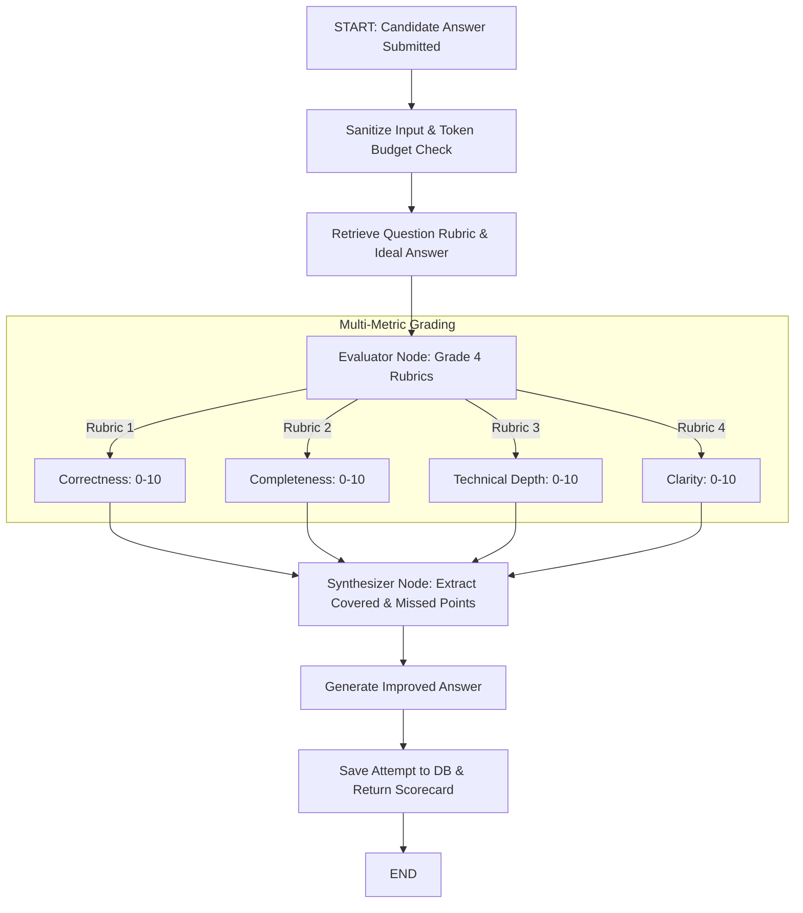
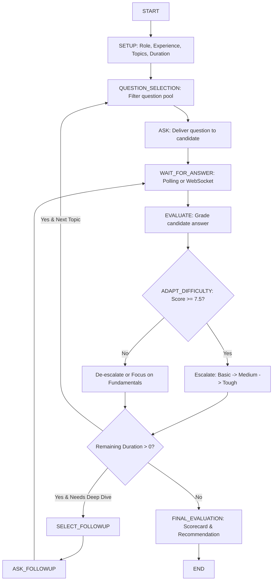

# AI Architecture & LangGraph Workflows (AI_ARCHITECTURE.md)
## Break The Code — Agentic Intelligence Specification

---

## 1. Core Principles
1. **Provider Independence**: All AI invocation routes through an abstract `LLMProvider` interface (`OpenAIProvider`, `AnthropicProvider`, `GeminiProvider`, `MockProvider`). No single-vendor lock-in.
2. **State Machine Persistence**: Complex multi-turn interviews run as deterministic LangGraph state graphs with checkpointing to PostgreSQL.
3. **Guardrails & Quality Control**: AI outputs are strictly validated using Pydantic schemas before persistence or presentation.

---

## 2. Answer Evaluation Graph (Think Mode Submission)

---

## 3. Mock Interview Workflow Graph

---

## 4. Observability & Cost Management
- **LangSmith Tracing**: Traces every run tree (`session_id`, prompt templates, token consumption, execution latency).
- **Prompt Injection Defense**: Input filters scan for control token exploits, delimiter injection, and jailbreak phrases before LLM dispatch.
- **Model Routing**: Cheaper lightweight models for Socratic hints and rapid grading; frontier reasoning models for full mock interviews and architecture defense.
