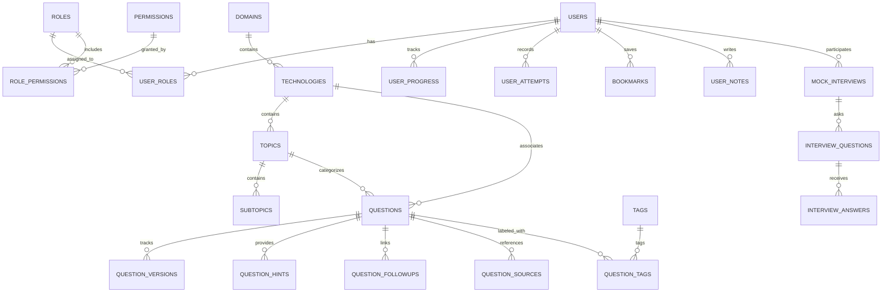

# Database Architecture & Schema Specification (DATABASE.md)
## Break The Code — Relational & Vector Data Model

---

## 1. Entity-Relationship Overview



---

## 2. Table Specifications

### 2.1 Core Identity & Access Control
- **`users`**: `id` (UUID PK), `email` (VARCHAR 255 UNIQUE), `hashed_password` (VARCHAR 255), `full_name` (VARCHAR 100), `avatar_url` (VARCHAR 500), `is_active` (BOOLEAN), `is_verified` (BOOLEAN), `xp` (INT DEFAULT 0), `streak_days` (INT DEFAULT 0), `created_at` (TIMESTAMPTZ), `updated_at` (TIMESTAMPTZ).
- **`roles`**: `id` (UUID PK), `name` (VARCHAR 50 UNIQUE), `description` (TEXT), `created_at` (TIMESTAMPTZ).  
  *Default Roles*: `SUPER_ADMIN`, `ADMIN`, `CONTENT_EDITOR`, `TECHNICAL_REVIEWER`, `MODERATOR`, `ANALYST`, `USER`.
- **`permissions`**: `id` (UUID PK), `code` (VARCHAR 100 UNIQUE), `description` (TEXT).  
  *Examples*: `questions:create`, `questions:publish`, `questions:delete`, `admin:access`.
- **`role_permissions`**: `role_id` (FK), `permission_id` (FK) - Composite PK.
- **`user_roles`**: `user_id` (FK), `role_id` (FK) - Composite PK.

### 2.2 Taxonomy & Hierarchies
- **`domains`**: `id` (UUID PK), `name` (VARCHAR 100 UNIQUE), `slug` (VARCHAR 100 UNIQUE), `description` (TEXT), `icon` (VARCHAR 50), `order_index` (INT).
- **`technologies`**: `id` (UUID PK), `domain_id` (UUID FK), `name` (VARCHAR 100), `slug` (VARCHAR 100 UNIQUE), `short_description` (TEXT), `icon` (VARCHAR 50), `is_active` (BOOLEAN DEFAULT TRUE), `order_index` (INT).
- **`topics`**: `id` (UUID PK), `technology_id` (UUID FK), `name` (VARCHAR 100), `slug` (VARCHAR 100), `description` (TEXT), `order_index` (INT).
- **`tags`**: `id` (UUID PK), `name` (VARCHAR 50 UNIQUE), `slug` (VARCHAR 50 UNIQUE).

### 2.3 Questions & Content Integrity
- **`questions`**:
  - `id` (UUID PK)
  - `slug` (VARCHAR 255 UNIQUE)
  - `technology_id` (UUID FK)
  - `topic_id` (UUID FK)
  - `title` (VARCHAR 500)
  - `difficulty` (ENUM: `BASIC`, `MEDIUM`, `TOUGH`)
  - `interview_depth` (ENUM: `L1`, `L2`, `L3`, `L4`, `L5`)
  - `question_type` (ENUM: `CONCEPTUAL`, `CODING`, `DEBUGGING`, `SCENARIO`, `SYSTEM_DESIGN`, `ARCHITECTURE`, `CODE_REVIEW`, `OUTPUT_BASED`, `TRADE_OFF`, `CASE_STUDY`, `RAPID_FIRE`, `PROJECT_BASED`, `RESUME_BASED`)
  - `role_target` (VARCHAR 100)
  - `experience_level` (VARCHAR 50)
  - `estimated_time_minutes` (INT DEFAULT 5)
  - `short_answer` (TEXT)
  - `interview_ready_answer` (TEXT)
  - `deep_explanation` (TEXT)
  - `architecture_notes` (TEXT)
  - `code_example` (TEXT)
  - `common_mistakes` (JSONB)
  - `interviewer_intent` (TEXT)
  - `status` (ENUM: `DRAFT`, `AI_REVIEW`, `EDITOR_REVIEW`, `TECHNICAL_REVIEW`, `APPROVED`, `PUBLISHED`)
  - `content_origin` (ENUM: `ORIGINAL`, `ADAPTED`, `SYNTHESIZED`, `LICENSED`)
  - `embedding` (vector(1536) NULLABLE)
  - `view_count` (INT DEFAULT 0)
  - `upvote_count` (INT DEFAULT 0)
  - `created_by` (UUID FK users)
  - `last_reviewed_at` (TIMESTAMPTZ)
  - `created_at` (TIMESTAMPTZ)
  - `updated_at` (TIMESTAMPTZ)
- **`question_versions`**:
  - `id` (UUID PK), `question_id` (UUID FK), `version_number` (INT), `content_snapshot` (JSONB), `change_summary` (TEXT), `created_by` (UUID FK), `created_at` (TIMESTAMPTZ).
- **`question_hints`**:
  - `id` (UUID PK), `question_id` (UUID FK), `hint_level` (INT: 1, 2, 3), `hint_type` (VARCHAR 50: `CONCEPTUAL`, `IMPLEMENTATION`, `ARCHITECTURE`), `content` (TEXT).
- **`question_sources`**:
  - `id` (UUID PK), `question_id` (UUID FK), `source_name` (VARCHAR 255), `source_url` (VARCHAR 1000), `license` (VARCHAR 100), `attribution_required` (BOOLEAN).

### 2.4 User Interactions & Attempts
- **`user_progress`**: `id` (UUID PK), `user_id` (UUID FK), `technology_id` (UUID FK), `questions_attempted` (INT), `questions_completed` (INT), `accuracy_rate` (FLOAT), `updated_at` (TIMESTAMPTZ).
- **`user_attempts`**: `id` (UUID PK), `user_id` (UUID FK), `question_id` (UUID FK), `candidate_answer` (TEXT), `time_spent_seconds` (INT), `score_overall` (FLOAT), `evaluation_details` (JSONB), `created_at` (TIMESTAMPTZ).
- **`bookmarks`**: `id` (UUID PK), `user_id` (UUID FK), `question_id` (UUID FK), `created_at` (TIMESTAMPTZ) - UNIQUE(user_id, question_id).
- **`user_notes`**: `id` (UUID PK), `user_id` (UUID FK), `question_id` (UUID FK), `note_text` (TEXT), `is_private` (BOOLEAN DEFAULT TRUE), `updated_at` (TIMESTAMPTZ).

---

## 3. Database Indexes & Search Optimization
```sql
-- Fast query indexes
CREATE INDEX idx_questions_slug ON questions(slug);
CREATE INDEX idx_questions_tech_status ON questions(technology_id, status);
CREATE INDEX idx_questions_topic ON questions(topic_id);
CREATE INDEX idx_questions_difficulty ON questions(difficulty);
CREATE INDEX idx_questions_created_at ON questions(created_at DESC);

-- Full text search index
CREATE INDEX idx_questions_fts ON questions USING GIN (
    to_tsvector('english', coalesce(title, '') || ' ' || coalesce(short_answer, '') || ' ' || coalesce(deep_explanation, ''))
);

-- pgvector cosine similarity index
-- CREATE INDEX idx_questions_embedding ON questions USING hnsw (embedding vector_cosine_ops);
```
