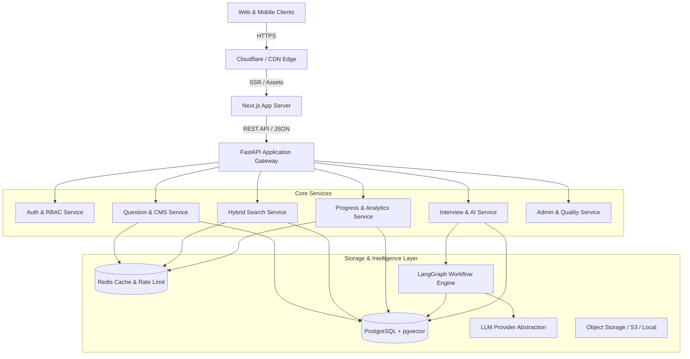
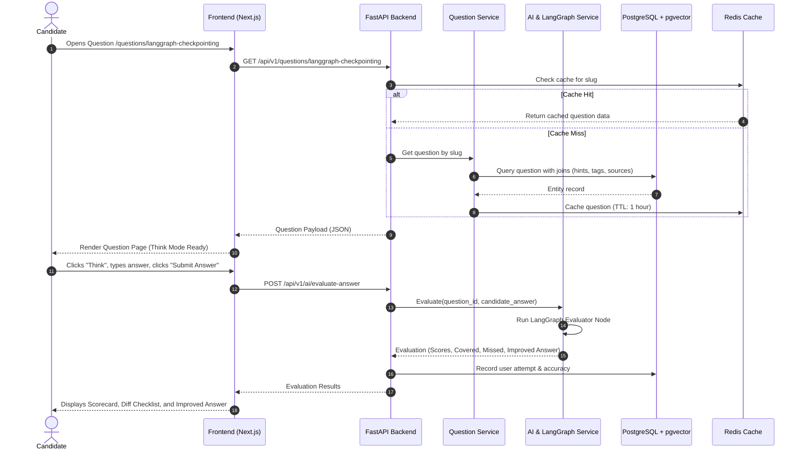

# High-Level Design (HLD)
## Break The Code — System Architecture

---

## 1. System Context & Top-Level Architecture

Break The Code utilizes a decoupled, high-performance monorepo architecture with a Next.js (React 19, TypeScript, Tailwind CSS) frontend and a Python (FastAPI, SQLAlchemy 2.0, Pydantic v2) backend. Persistent state resides in PostgreSQL (with pgvector), high-speed caching and rate-limiting in Redis, and asynchronous workflows in LangGraph.

---

## 2. Component Breakdown

### 2.1 Frontend Tier (Next.js 15+ App Router)
- **Rendering Strategy**:
  - Static Generation & ISR for high-volume SEO pages (`/`, `/questions/[slug]`, `/learn/[technology]`).
  - Client-Side Rendering with TanStack Query for authenticated, dynamic interaction surfaces (`/dashboard`, `/interview/session/[id]`, `/admin/*`).
- **Design System**: Centralized token architecture in Tailwind CSS with semantic tokens for dark and light modes, typography scales, glass effects, and micro-animations.

### 2.2 API & Business Logic Tier (FastAPI)
- Clean four-layer architecture:
  `Router -> Service -> Repository -> Database / Cache`
- Strict dependency injection for database sessions, caching clients, current user auth, and LLM instances.
- Zero business logic inside router handlers.

### 2.3 AI & Agentic Tier (LangGraph + LangSmith)
- State machine graphs manage interview setup, question routing, response ingestion, multi-rubric evaluation, follow-up generation, and final report generation.
- LLM Provider Abstraction layer (`LLMProviderBase -> OpenAIProvider, AnthropicProvider, GeminiProvider, LocalProvider`) completely decouples business logic from vendors.

### 2.4 Data Tier
- **PostgreSQL 16**: Relational source of truth for users, questions, versions, reviews, bookmarks, and attempts.
- **pgvector**: Cosine similarity indexing over question embeddings for semantic search and question recommendation.
- **Redis 7**: Session tokens, sliding-window rate limit counters, hot question cache, and real-time interview state.
- **Object Storage**: S3-compatible or secure local filesystem storage for resumes and diagrams.

---

## 3. High-Level Data Flow

